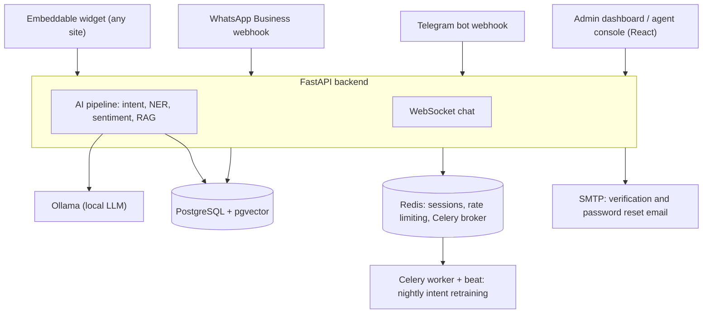

<div align="center">

# TeeDesk

Self-hostable AI customer support platform: real-time chat, a local-LLM support pipeline, and a WhatsApp/Telegram/web widget admin dashboard, with no paid AI API required.

[](https://github.com/teevexa/teedesk/actions/workflows/ci.yml)
[](https://react.dev)
[](https://fastapi.tiangolo.com)
[](https://github.com/pgvector/pgvector)
[-000000?logo=ollama&logoColor=white)](https://ollama.com)
[](LICENSE)

</div>

## Links

- Repository: [github.com/teevexa/teedesk](https://github.com/teevexa/teedesk)
- Reporting a vulnerability: [SECURITY.md](SECURITY.md)
- Contributing: [CONTRIBUTING.md](CONTRIBUTING.md)

There is no hosted demo. TeeDesk is designed to be cloned and self-hosted (see Getting started and Deployment below).

## Overview

TeeDesk is an open-source customer support platform for teams that want AI-assisted chat without sending customer data to a third-party AI API. A visitor talks to an embeddable chat widget or a WhatsApp/Telegram bot; the backend classifies intent, checks sentiment, retrieves relevant knowledge-base content and drafts a reply, all with models that run on infrastructure you control. When the AI is unsure or a conversation turns negative, it escalates to a human agent in the included admin dashboard.

It is a multi-tenant monorepo: a React admin dashboard and agent console, an embeddable widget for third-party sites, and a FastAPI backend that owns the database, the AI pipeline and the WhatsApp/Telegram webhook handling. Everything needed to run it, Postgres, Redis and the LLM itself, runs in Docker (or Kubernetes) alongside the app.

TeeDesk is maintained by [Teevexa](https://www.teevexa.com) as an open-source project. It has had real cross-tenant data-isolation bugs found and fixed before (see the git history), so anything touching authentication, authorization or webhook verification gets extra scrutiny in review.

## Key features

| Area | What it does |
| --- | --- |
| Real-time chat | WebSocket-based chat with typing indicators, presence, optimistic message sending, automatic reconnect, and voice input/output via the browser's Web Speech API. |
| AI support pipeline | Each incoming message runs through sentence-transformers intent classification, spaCy named-entity extraction and sentiment scoring, then a RAG step retrieves relevant knowledge-base passages before a locally-run LLM (via Ollama) drafts the reply. |
| Knowledge base | Upload PDF or DOCX documents; they are chunked, embedded and stored in pgvector so the AI pipeline can ground its answers in your own content. |
| Human handoff | A conversation with low AI confidence or negative sentiment is automatically flagged for escalation; agents can claim and resolve escalated conversations from the agent queue. |
| Multi-tenancy | Every row is scoped to a `tenant_id`. Roles are customer, agent, admin and super_admin; a user granted access to more than one tenant can switch between them from the dashboard. |
| Per-tenant settings | Chat branding, which AI pipeline steps are enabled, and which channels (WhatsApp, Telegram) are active are configured per tenant and actually drive the live pipeline and webhook behaviour, not just stored as preferences. |
| Multi-channel | An embeddable web widget for any site, a WhatsApp Business channel (Meta Cloud API webhooks) and a Telegram bot (Bot API webhooks), all routed through the same conversation pipeline. |
| Analytics | Conversation volume, sentiment distribution and intent trends, computed from real conversation data. |
| Fine-tuning loop | A nightly Celery job retrains intent classification from agent-verified feedback, using similarity search rather than gradient descent, so it improves without a GPU or a training pipeline. |
| Auth | Email/password with JWT access and refresh tokens, email verification and password reset over real SMTP. |

## How it works



Notable engineering decisions:

- **Local AI, no paid API**: the LLM (Mistral 7B via Ollama), the embedding model (sentence-transformers) and the NER model (spaCy) all run locally. There is no OpenAI or Anthropic dependency anywhere in the pipeline.
- **Tenant isolation enforced in code, not just by convention**: every tenant-scoped router dependency goes through `verify_tenant_access` or `verify_conversation_access`; the project's own history includes fixing cross-tenant IDOR bugs, which is why this is called out explicitly in CONTRIBUTING.md as needing extra review.
- **Retraining without a training pipeline**: the nightly fine-tuning job re-ranks intents by embedding similarity against verified feedback rather than running gradient descent, so it works without a GPU.
- **Separate dev and production Docker Compose files**: the plain `docker compose up -d` stack publishes Postgres, Redis and Ollama with weak defaults, by design, for a fast local setup; the production file binds the API to localhost behind a reverse proxy and requires real generated secrets. Running the dev stack on a public IP is explicitly unsafe (see Deployment).

## Tech stack

| Layer | Technology |
| --- | --- |
| Monorepo | Turborepo, npm workspaces |
| Web frontend | React 18, Vite, TypeScript, Zustand, TanStack Query, Tailwind CSS, shadcn/ui, Framer Motion |
| Widget | Vanilla JS/TypeScript, built as an IIFE bundle with Vite |
| Backend | FastAPI, Uvicorn (Python), REST and WebSocket |
| Database | PostgreSQL 16 with the pgvector extension, Alembic migrations |
| Cache and queue | Redis 7 (sessions, rate limiting, Celery broker) |
| Background jobs | Celery (worker and beat scheduler) |
| LLM | Ollama, running Mistral 7B Instruct or Llama 3.1 locally |
| Embeddings | sentence-transformers (all-MiniLM-L6-v2) |
| NER | spaCy (en_core_web_sm) |
| Sentiment | cardiffnlp/twitter-roberta, run server-side |
| Channels | Meta Cloud API (WhatsApp), Telegram Bot API |
| Email | SMTP (any provider) |
| Infrastructure | Docker Compose (dev and production), Kubernetes manifests as an alternative |
| CI | GitHub Actions: lint, type-check, format check, build, and a pytest run for the API |

## Project structure

```
teedesk/
  apps/
    web/              React admin dashboard, agent console and chat UI
    widget/            Embeddable chat widget (drop-in script tag)
  packages/
    shared-types/      TypeScript interfaces, not yet consumed by the apps (see Status)
  services/
    api/
      app/ai/           Intent, NER, sentiment and RAG pipeline
      app/routers/       REST and WebSocket endpoints, including whatsapp.py and telegram.py
      app/tasks/         Celery app and the nightly retraining task
      app/models/        SQLAlchemy models
      alembic/versions/  Database migrations
      tests/             Pytest suite (mocks the DB session, no live Postgres needed)
    inference/          Ollama configuration and Modelfile
  infrastructure/
    docker/             docker-compose for local dev and for production, plus a Caddy reverse proxy config
    k8s/                Kubernetes manifests, an alternative to Docker Compose
  scripts/              setup.sh and dev.sh developer utilities
  .github/workflows/    CI pipeline
```

## Getting started

### Prerequisites

- Node.js 18 or later
- Python 3.11 or later
- Docker and Docker Compose

### Quick start

```bash
git clone https://github.com/teevexa/teedesk.git
cd teedesk
bash scripts/setup.sh

bash scripts/dev.sh infra   # starts PostgreSQL, Redis, Ollama
bash scripts/dev.sh pull    # pulls mistral:7b-instruct and nomic-embed-text

bash scripts/dev.sh web     # React app at http://localhost:5173
bash scripts/dev.sh api     # FastAPI at http://localhost:8000, docs at /docs
```

### Background jobs (optional, enables scheduled retraining)

The fine-tuning pipeline runs as a Celery job. With Redis running (`bash scripts/dev.sh infra`), start the worker and beat scheduler in separate terminals from `services/api/`:

```bash
celery -A app.tasks.celery_app worker --loglevel=info
celery -A app.tasks.celery_app beat --loglevel=info
```

Without the worker running, a manual retrain triggered from the admin UI returns a task ID but nothing executes.

## Environment variables

Each app documents its own variables in full; the table below summarises the ones you need to get started.

| Variable | File | Required | Purpose |
| --- | --- | --- | --- |
| `VITE_API_URL`, `VITE_WS_URL` | [`apps/web/.env.example`](apps/web/.env.example) | Yes | Backend API and WebSocket URLs |
| `DATABASE_URL` | [`services/api/.env.example`](services/api/.env.example) | Yes | PostgreSQL connection string |
| `REDIS_URL` | `services/api/.env.example` | Yes | Session store, rate limiting, Celery broker |
| `SECRET_KEY` | `services/api/.env.example` | Yes | JWT signing key; generate with `openssl rand -hex 32` |
| `OLLAMA_BASE_URL`, `OLLAMA_MODEL` | `services/api/.env.example` | Yes | Local LLM endpoint and model name |
| `TRUSTED_PROXY_COUNT` | `services/api/.env.example` | For deployment | Number of trusted reverse-proxy hops in front of the API, affects rate-limiting and audit-log IP accuracy |
| `WHATSAPP_VERIFY_TOKEN`, `WHATSAPP_ACCESS_TOKEN`, `WHATSAPP_PHONE_NUMBER_ID`, `WHATSAPP_APP_SECRET` | `services/api/.env.example` | No | Enables the WhatsApp channel, also needs the tenant's WhatsApp toggle turned on in Settings |
| `TELEGRAM_BOT_TOKEN`, `TELEGRAM_WEBHOOK_SECRET` | `services/api/.env.example` | No | Enables the Telegram channel, also needs the tenant's Telegram toggle turned on in Settings |
| `SMTP_HOST` and related `SMTP_*` | `services/api/.env.example` | No | Sends real verification and password-reset email, emails are logged instead of sent when blank |
| `POSTGRES_PASSWORD`, `REDIS_PASSWORD` | [`infrastructure/docker/.env.prod.example`](infrastructure/docker/.env.prod.example) | For production | Real generated secrets for the production Docker Compose stack |

## Scripts

| Command | What it does |
| --- | --- |
| `npm run dev` | Starts all apps via Turborepo |
| `npm run build` | Builds all packages |
| `npm run lint` | Lints all packages |
| `npm run type-check` | Type-checks all packages |
| `npm run format` / `format:check` | Formats, or checks formatting, with Prettier |
| `bash scripts/dev.sh infra` | Starts Docker infrastructure (Postgres, Redis, Ollama) |
| `bash scripts/dev.sh web` / `api` | Starts the web frontend or the API alone |
| `bash scripts/dev.sh pull` | Pulls the Ollama models |
| `bash scripts/dev.sh reset` | Resets Docker volumes |
| `celery -A app.tasks.celery_app worker` / `beat` | Starts the Celery worker or beat scheduler, from `services/api/` |

## Testing and CI

The API has a pytest suite under `services/api/tests/` (the database session is mocked, so no live Postgres or Redis is needed to run it): `cd services/api && pytest tests/ -v`.

GitHub Actions runs on every push to `main`/`develop` and every pull request against `main`: TypeScript type-checking, ESLint, Prettier formatting, a web app build, a Python lint pass with ruff (scoped to undefined-name and syntax errors, since the codebase has no prior style-lint config), and the pytest suite. See [`.github/workflows/ci.yml`](.github/workflows/ci.yml).

## Deployment

### Self-hosted (recommended for privacy)

The plain `docker compose up -d` stack (no `-f` flag) is a **development** configuration: it publishes Postgres, Redis and Ollama on all interfaces with a weak default Postgres password and no Redis password. That is fine on your own machine; it is not safe on a public IP.

For anything reachable from the internet, use the production compose file, which binds the API to localhost and expects a reverse proxy (an example [Caddyfile](infrastructure/docker/Caddyfile) is included) in front of it:

```bash
cd infrastructure/docker
cp .env.prod.example .env.prod
# edit .env.prod: set a real SECRET_KEY, POSTGRES_PASSWORD and REDIS_PASSWORD
# (openssl rand -hex 32 is a good way to generate each one)
docker compose -f docker-compose.prod.yml up -d
```

Kubernetes manifests are also available under `infrastructure/k8s/` as an alternative to Docker Compose.

### Cloud (lower effort, ongoing cost)

The frontend can be deployed to any static host (for example Vercel), the API to any container host (for example Railway or Render), and PostgreSQL with pgvector and Redis to any managed provider that supports them (for example Supabase or Neon for Postgres, Upstash for Redis). Ollama needs a host with enough RAM, or a GPU, to run the model; a CPU-only small VM will be slow.

## Status and roadmap

Implemented and working:

- Monorepo build (Turborepo), React admin dashboard, agent queue, analytics and knowledge base UI
- Real-time WebSocket chat with voice input/output
- FastAPI backend: JWT auth with refresh tokens, all REST endpoints, WebSocket chat
- Full AI pipeline: embedding, sentiment, NER, intent classification, RAG, local LLM response
- Multi-tenancy with role-based access and tenant switching for users with access to more than one tenant
- Per-tenant settings that actually drive pipeline and channel behaviour
- Human handoff with auto-escalation and an agent claim/resolve flow
- Email verification and password reset over real SMTP
- Embeddable chat widget, WhatsApp Business channel, Telegram bot channel
- File attachments and knowledge-base document ingestion (PDF, DOCX)
- Nightly incremental intent retraining via Celery beat
- Docker Compose (dev and production) and Kubernetes manifests
- CI pipeline for lint, type-check, build and tests

Planned:

- Consuming `packages/shared-types` from the apps (the package exists but isn't wired in yet)
- Billing (Stripe or Flutterwave) for a hosted SaaS offering

## Security

See [SECURITY.md](SECURITY.md) for the full policy, including scope and what to do if you find a vulnerability: please report it privately rather than opening a public issue.

In short: every tenant-scoped database query is checked against the authenticated user's tenant, WhatsApp and Telegram webhooks are signature-verified, and the production Docker Compose file deliberately does not expose services with default credentials the way the development stack does.

## License

MIT. See [LICENSE](LICENSE). Copyright Teevexa Ltd.

## Contributing

See [CONTRIBUTING.md](CONTRIBUTING.md) for the development setup, code style and what CI checks before you open a pull request. CONTRIBUTING.md also includes the project's code of conduct.

## About

TeeDesk belongs to [Teevexa Ltd](https://www.teevexa.com) and is released as open source. It was built by [Benjamin Baya](https://benjaminbaya.com).

Contact: [hello@teevexa.com](mailto:hello@teevexa.com)
